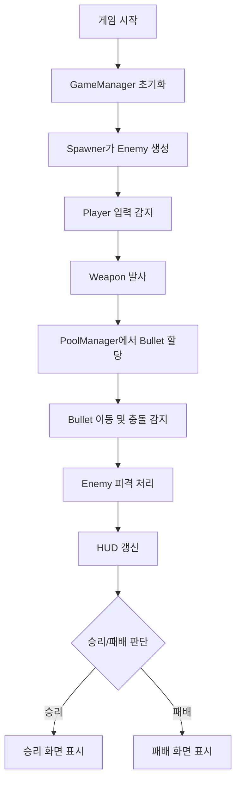
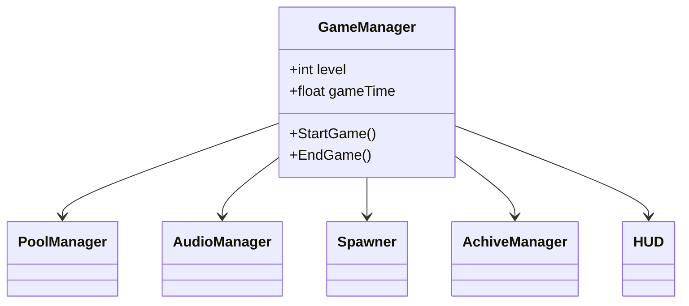

# 🧛 Vampire

Unity 기반의 2D 액션 게임 프로젝트입니다.  
이 문서는 프로젝트 전체 디렉토리 구조, 폴더별 책임, 주요 시스템 흐름 및 예시를 제공합니다.

---

## 📁 프로젝트 구조

```
Vampire/
├── Assets/
│   ├── Scripts/
│   │   ├── Datas/
│   │   ├── Game/
│   │   ├── UI/
│   │   └── Utility/
│   └── ...
├── Packages/
└── ProjectSettings/
```

---

## 📦 폴더 책임 (Folder Responsibilities)

| 폴더            | 역할                                                         |
|-----------------|--------------------------------------------------------------|
| `Datas/`        | `ScriptableObject` 기반 설정 데이터 정의                    |
| `Game/`         | 게임 로직, 캐릭터, 무기, 적, 매니저 등 핵심 시스템 구현     |
| `UI/`           | HUD, 레벨업, 결과창 등 사용자 인터페이스 요소 관리         |
| `Utility/`      | 싱글턴, 확장 메서드, 공통 유틸리티 스크립트                  |

---

## 🎮 게임 실행 흐름 (Game Flow)

1. **게임 시작** → `GameManager` 초기화  
2. **적 생성** → `Spawner`가 `Enemy` 생성  
3. **플레이어 입력** → `Player` 이동 및 공격 처리  
4. **투사체 발사** → `Weapon`이 `Bullet` 생성 / `PoolManager`에서 할당  
5. **충돌 처리** → `Bullet`이 `Enemy`와 충돌, 데미지 계산 및 비활성화  
6. **HUD 갱신** → `HUD`가 경험치, 레벨, 체력, 시간 등을 업데이트  
7. **승리/패배 판단** → 조건 충족 시 `GameResult` UI 표시  



---

## 🧩 매니저 관계도 (Manager Relationships)

- `GameManager`
  - 관리: 게임 상태, 경험치, 레벨, 시간, 승패 등
  - ├── `PoolManager` (오브젝트 풀 관리)
  - ├── `AudioManager` (BGM 및 효과음 재생)
  - ├── `Spawner` (적 생성 및 타이밍 제어)
  - ├── `AchiveManager` (업적 조건 및 보상 처리)
  - └── `HUD` (UI 정보 갱신)



---

## 🚀 기능 예시: Bullet 발사 흐름 (Feature Example)

```plaintext
Player.cs (입력 감지)
  ↓
Weapon.cs (방향 및 발사 로직)
  ↓
PoolManager.cs (재사용 가능한 Bullet 할당)
  ↓
Bullet.cs (이동, 충돌 감지, 데미지 처리)
  ↓
Enemy.cs (피격 및 사망 처리)
  ↓
HUD.cs (처치 수 갱신)
```

---

## 📂 스크립트 주요 요약 (Scripts Overview)

- **Datas/ItemData.cs**: 아이템 정보 설정 (`ScriptableObject`)  
- **Game/GameManager.cs**: 게임 전반 상태 제어  
- **Game/Player.cs**: 플레이어 이동 및 입력 처리  
- **Game/Spawner.cs**: 적 생성 로직  
- **Game/PoolManager.cs**: 오브젝트 풀 관리  
- **UI/HUD.cs**: HUD 정보 업데이트  
- **Utility/Singleton.cs**: 싱글턴 패턴 베이스 클래스  

---

## 📝 참고

- 각 시스템은 **모듈화** 되어 있어, 추가 기능 도입 시에도 **폴더 및 클래스 구조를 유지**하면 확장과 유지보수가 용이합니다.
- 필요에 따라 **클래스 다이어그램**이나 **유스케이스 다이어그램**을 추가하면 더욱 효과적입니다.